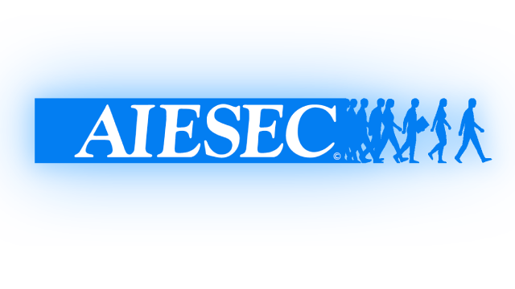

[comment]: # "This is the standard layout for the project, but you can clean this and use your own template"

# AISEC local comittee management system

---

<!-- 
This is a sample image, to show how to add images to your page. To learn more options, please refer [this](https://projects.ce.pdn.ac.lk/docs/faq/how-to-add-an-image/)

 -->

<!-- 
Aiesec
 -->

## Team
-  e19275, Peeris M.S., [email](mailto:e19275@eng.pdn.ac.lk)
-  e18059, De Silva D.M., [email](mailto:e18059@eng.pdn.ac.lk)
-  e19366, Senevirathne W.A.M.P., [email](mailto:e19366@eng.pdn.ac.lk)
-  e19029, Avinash K.T.D., [email](mailto:e19029@eng.pdn.ac.lk)

## Table of Contents
1. [Introduction](#introduction)
2. [Problem](#problem)
3. [Solutions](#solutions)
4. [Main functionalities of the system](#main-functionalities-of-the-system)
5. [Tech Stack](#tech-stack-🛠️)
6. [Links](#links)

---

## Introduction

AIESEC Local Committee Management System

## Problem ❓:

AIESEC's current management system, based on Google apps, faces issues with:

- Data Insecurity
- Inefficiencies
- Poor User Experience

## Solutions 💭:

We're developing a new system focused on:

- **Robust Security 🔐**: Through tiered user access.
- **Automation** 🤖: Streamlining repetitive tasks.
- **Enhanced UX**✨: A unified, user-friendly platform.

## Main functionalities of the system ⚙️:

### Progress So Far ✅:

1. Member management 
2. 75% of iGV processes including:
   - Project management
   - Slot management
   - Application management

### Upcoming Features ⬆️:

- **iGV (Remaining 25%)**: 
   1. Email automation system
   2. Work reminder notifications
   3. Post-arrival project participant management
   4. Partner organizations management system
   
- **iGT**: 
   1. Internship opportunities system
   2. Application management
   3. Partner organization system 
   4. New partnership system

- **oGT + oGV**: 
   1. Applicants selection system
   2. Marketing campaign system
   3. Opportunities management system
   4. Auto-suggestions for applicants

- **Marketing**: 
   1. Campaign management
   2. Content management (photos, videos, posts, blogs)

- **Business Development**: 
   1. Market research & cold calls system
   2. Revenue dashboard
   3. Member target system
   

- **People Management**: 

   *Note: Managed by the People Management team but accessible to all members.*

   1. Task management system (with reminders & member performance metrics)
   2. Interview management tool
   3. Opportunities hub (local, national, and international)
   4. Event and special announcement notifications
   5. Confidential member feedback (accessible only to President & VPs)
   6. Achievement badges for member profiles
   7. Training resources hub 

- **Finance**: 
   1. Finance report publishing portal
   2. Finance data collection (for future budgets and more)

---

## Tech Stack 🛠️:

- **Client:** 
   
   
   

- **Server:** 
   
   
   
   
   

....
## Links 🔗:

- ### 🤺Run Locally ? check [installation guide](https://github.com/cepdnaclk/e19-co227-aiesec-local-committee-manangement-system/blob/main/client/README.md)
- [Project Repository](https://github.com/cepdnaclk/{{ page.repository-name }}){:target="_blank"}
- [Project Page](https://cepdnaclk.github.io/{{ page.repository-name}}){:target="_blank"}
- [Department of Computer Engineering](http://www.ce.pdn.ac.lk/)
- [University of Peradeniya](https://eng.pdn.ac.lk/)

[//]: # (Please refer this to learn more about Markdown syntax)
[//]: # (https://github.com/adam-p/markdown-here/wiki/Markdown-Cheatsheet)
